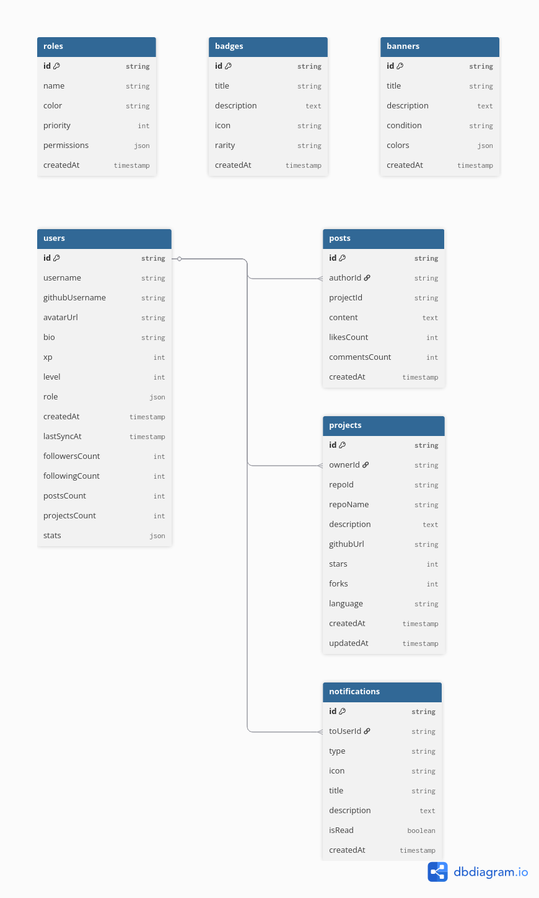
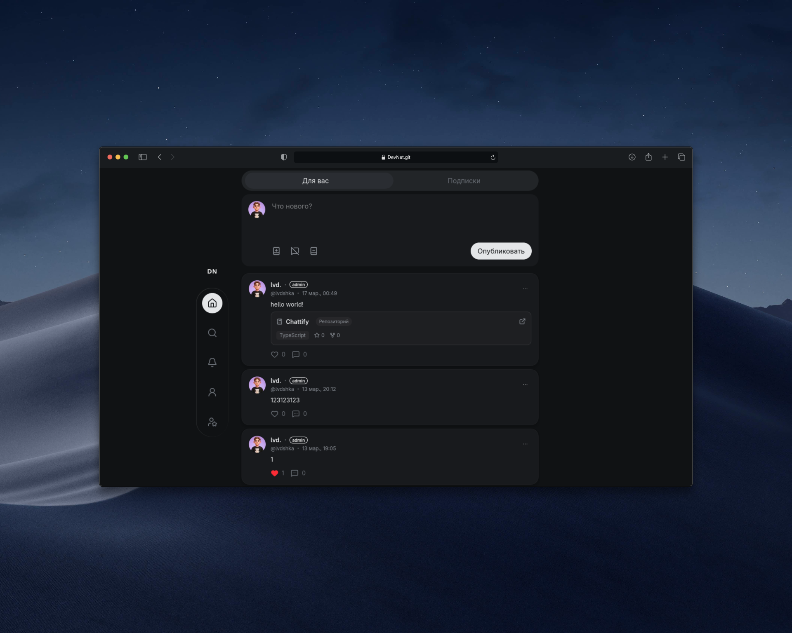
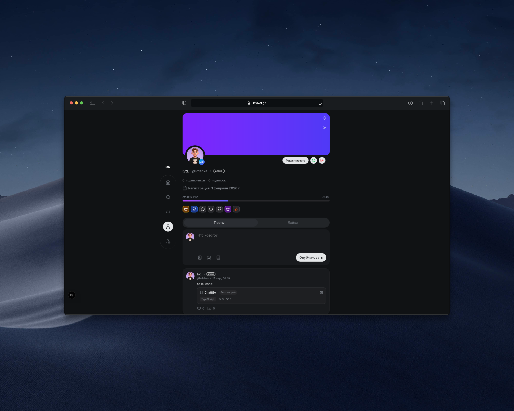
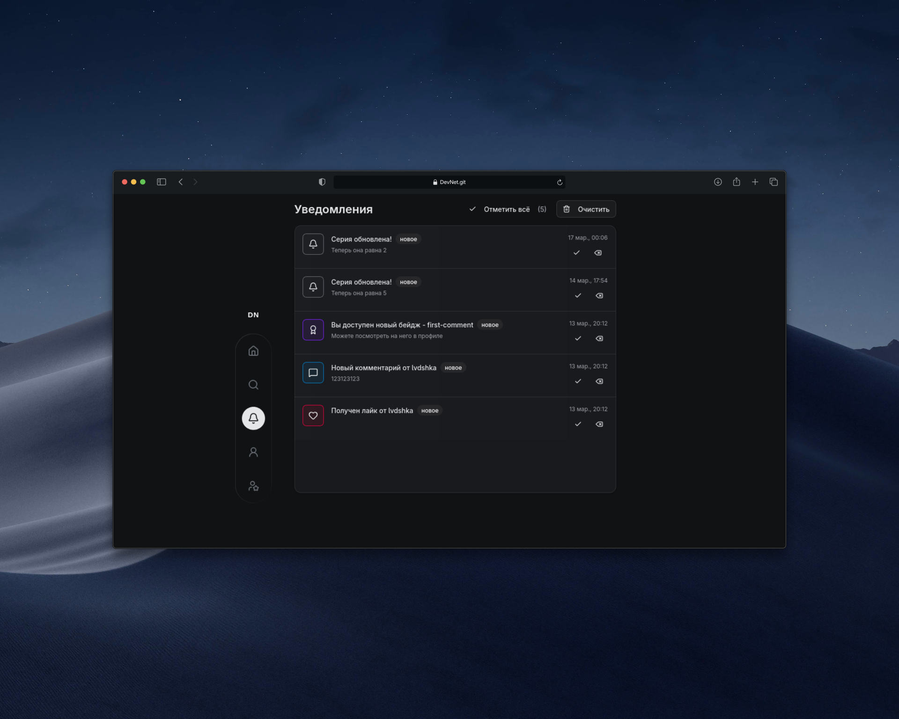
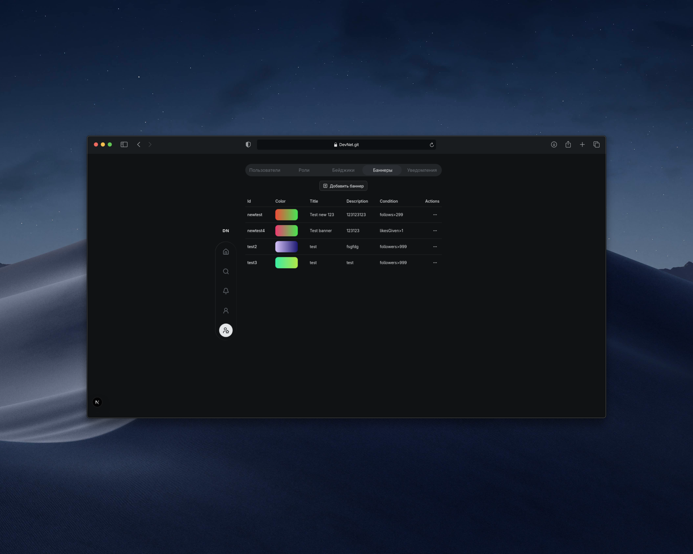

# 🚀 DevNet

> **DevNet** — социальная платформа для разработчиков, где можно делиться проектами, находить единомышленников, демонстрировать свои GitHub-репозитории и получать достижения за активность.

> Большая часть дизайна была повзаимствована у [итд](https://итд.com)

DevNet сочетает **социальную сеть**, **портфолио разработчика** и **геймификацию**, создавая пространство для обмена опытом и развития.

---

# ✨ Основные возможности

### 🔐 Авторизация
- Вход **только через GitHub**
- Автоматическое получение данных профиля
- Подстановка `username` из GitHub при регистрации

---

### 👤 Профиль пользователя
Каждый пользователь имеет страницу профиля со следующими данными:

- баннер
- аватар
- username
- GitHub username
- статистика активности
- список репозиториев
- посты пользователя
- бейджики и уровень

---

### 📦 Синхронизация GitHub
После входа DevNet автоматически:

- получает список репозиториев пользователя
- сохраняет их в базе
- отображает их в профиле

Пользователь может вручную нажать **Sync**, чтобы обновить список.

---

### 📝 Посты
Пользователи могут публиковать посты:

- текстовые сообщения
- сообщения с привязанным GitHub-репозиторием

Каждый пост поддерживает:

- ❤️ лайки
- 💬 комментарии
- отображение автора
- отображение репозитория

---

### ❤️ Лайки
- пользователь может лайкать пост
- автор получает увеличение статистики
- используется **Firestore транзакция**

---

### 💬 Комментарии
Пользователь может:

- добавлять комментарии
- удалять комментарии

При этом автоматически обновляются счетчики.

---

### 👥 Подписки
Пользователи могут:

- подписываться друг на друга
- отписываться

Система обновляет:

- `followersCount`
- `followingCount`

---

# 🏆 Геймификация

DevNet содержит систему геймификации.

### ⭐ XP (опыт)

XP начисляется за:

| Событие | XP |
|------|------|
| Создание поста | +25 |
| Лайк | +5 |
| Комментарий | +10 |
| Подписка | +10 |

---

### 📈 Уровни

XP увеличивает уровень пользователя.

Формула: ```XP(level) = 100 × (level + 1)^2```

---

### 🎖 Бейджики

Пользователь может получать достижения.

Примеры:

| Бейдж | Условие |
|------|------|
| new-creator | 1 пост |
| first-5-posts | 5 постов |
| first-like | 1 лайк |
| appreciated | 50 лайков |
| first-followers | 10 подписчиков |

```Важно! достижения нужно добавлять вручную```

---

# 🔔 Уведомления

Система уведомлений сообщает о событиях:

- лайк поста
- комментарий
- новый подписчик
- получение бейджа
- системные уведомления

Типы уведомлений:
- like
- comment
- follow
- badge
- system
- alert
- error

---

# 🛡 Админ панель

Администраторы могут:

### 👥 Управлять пользователями
- поиск пользователей
- просмотр профиля
- удаление пользователя

---

### 🎖 Управлять бейджами
- создавать новые бейджи
- удалять бейджи
- настраивать редкость

---

### 🎭 Управлять ролями
- создавать роли
- изменять права
- назначать роли пользователям

---

# 🧰 Технологический стек

## Frontend
- **Next.js**
- **React**
- **TypeScript**

## UI
- **TailwindCSS**
- **shadcn/ui**
- **lucide-react**
- **sonner (toast notifications)**

## Backend
- **Firebase**

Используется:

- Firebase Authentication
- Firestore Database

## Admin
- **firebase-admin**

---

# 🗂 Архитектура проекта

Проект построен с использованием **Next.js App Router** и разделён на логические модули, что упрощает масштабирование и поддержку.

## Структура проекта

    src
     ├── actions
     │   ├── badges
     │   ├── banners
     │   ├── comments
     │   ├── follow
     │   ├── likes
     │   ├── posts
     │   ├── roles
     │   ├── notifications
     │   ├── gamification
     │   ├── streak
     │   └── admin
     │
     ├── app
     │   ├── admin
     │   ├── profile
     │   ├── post
     │   ├── notifications
     │   └── layout.tsx
     │
     ├── components
     │   └── [...]
     │
     ├── hooks
     │   └── [...]
     │
     ├── interfaces
     │   └── [...]
     │
     ├── lib
     │   └── [...]
     │
     ├── stores
     │
     ├── utils
     │
     └── styles

### Описание директорий

| Папка | Назначение |
|------|------|
| **actions** | Server Actions и бизнес-логика |
| **app** | страницы Next.js |
| **components** | UI компоненты |
| **hooks** | React hooks |
| **interfaces** | TypeScript интерфейсы |
| **lib** | подключения Firebase |
| **stores** | Zustand состояния |
| **utils** | вспомогательные функции |

---

# 🗄 Структура базы данных (Firestore)
<p align="center">
  
</p>

---

## 📸 Interface

<table>
<tr>
<td align="center">

<br/>
<b>Home Feed</b>
</td>
<td align="center">

<br/>
<b>User Profile</b>
</td>
</tr>
<tr>
<td align="center">

<br/>
<b>Notifications View</b>
</td>
<td align="center">

<br/>
<b>Admin Panel</b>
</td>
</tr>
</table>
